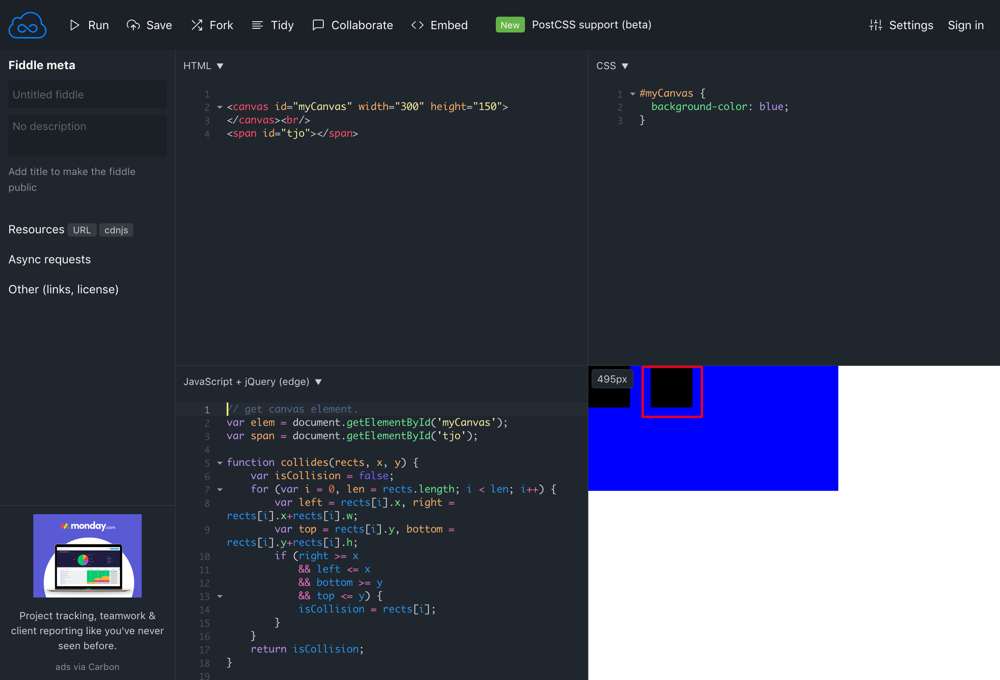

# chromepdcv

... allows you to find elements in a website or regions rendered within a canvas and click them.
You can also just get the position or the node(s) at that position.




### Install
```bash
brew install opencv
```

opencv: stable 4.0.1 (bottled)
Open source computer vision library
https://opencv.org/
/usr/local/Cellar/opencv/4.0.1 (679 files, 226MB) *
  Poured from bottle on 2019-01-24 at 22:34:46

```bash
go get -u github.com/rand99/chromedpcv
```


### Try yourself

```bash
cd example
./download_chromium
go build . && ./example
```

##### Documentation
[godoc](https://godoc.org/github.com/rand99/chromedpcv)

##### Known issues
chrome headless doesn't work, must be a chromedp thing
```bash
2019/02/10 19:33:51 timeout waiting for initial target
```